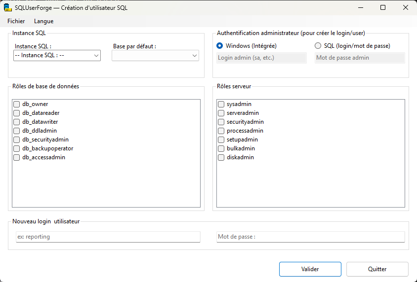
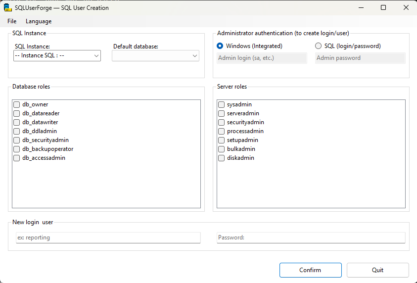

# SQLUserForge

## 🇫🇷 Français
*(Version française du README – voir plus bas pour l’anglais)*

**SQLUserForge** est une application Windows Forms moderne permettant de créer rapidement des **logins** et **users SQL Server**, d’assigner des rôles, et de simplifier l’administration quotidienne des bases de données.

## ✨ Fonctionnalités

- Découverte automatique des instances SQL locales
- Connexion via :
  - Authentification Windows (intégrée)
  - Authentification SQL (login / mot de passe)
- Sélection de la base de données par défaut
- Création d’un login SQL avec mot de passe
- Création automatique de l’utilisateur lié dans la base
- Attribution des rôles :
  - Rôles de base de données (`db_owner`, `db_datareader`, etc.)
  - Rôles serveur (`sysadmin`, `serveradmin`, etc.)
- Interface multilingue (**Français / Anglais**)
- Fenêtre de confirmation récapitulative avant création
- Design moderne, clair et professionnel

## 📸 Captures d’écran

## 🛠 Prérequis

- Windows 10/11
- .NET 9 ou plus récent
- SQL Server (toutes éditions supportées)

## 🚀 Installation

1. Télécharger la dernière version depuis la section **Releases**.
2. Lancer l'application en ouvrant l’exécutable SQLUserForge.exe.

/!\ Nécessite les droits administrateur /!\

## 📖 Utilisation

1. Choisissez une **instance SQL** dans la liste.
2. Sélectionnez un mode d’**authentification**.
3. Entrez les informations d’admin si nécessaire.
4. Sélectionnez la **base par défaut**.
5. Renseignez le **login à créer** et son **mot de passe**.
6. Cochez les rôles à attribuer.
7. Cliquez sur **Créer** → un résumé apparaît avant validation.

## 🌐 Internationalisation

- Français 🇫🇷
- Anglais 🇬🇧

---

## 📢 Auteur
Développé par **Maxime Bory**.  
GitHub : [https://github.com/plumedours](https://github.com/plumedours)  

### 💖 Me soutenir
Appréciez-vous mon travail ? Vous pouvez m’encourager en [m’offrant un café sur Ko-fi](https://ko-fi.com/borymaxime).
Merci beaucoup pour votre soutien ! ☕✨

## 📜 Licence

MIT License – libre d’utilisation et de modification.

---

## 🇬🇧 English
*(English version of the README – see above for French)*

**SQLUserForge** is a modern Windows Forms application that allows you to quickly create **SQL Server logins** and **users**, assign roles, and simplify daily database administration.

## ✨ Features

- Automatic discovery of local SQL instances
- Connection via:
  - Windows Authentication (integrated)
  - SQL Authentication (login / password)
- Default database selection
- Creation of a SQL login with password
- Automatic creation of the linked database user
- Role assignment:
  - Database roles (`db_owner`, `db_datareader`, etc.)
  - Server roles (`sysadmin`, `serveradmin`, etc.)
- Multilingual interface (**French / English**)
- Confirmation dialog summarizing actions before creation
- Modern, clean, and professional design

## 📸 Screenshots

## 🛠 Requirements

- Windows 10/11
- .NET 9 or later
- SQL Server (all editions supported)

## 🚀 Installation

1. Download the latest version from the **Releases** section.
2. Run the installer or the standalone executable.
3. Launch the application from the Start menu or desktop shortcut.

## 📖 Usage

1. Choose a **SQL instance** from the list.
2. Select an **authentication mode**.
3. Enter admin credentials if needed.
4. Select the **default database**.
5. Enter the **login to create** and its **password**.
6. Check the roles to assign.
7. Click **Create** → a summary will be displayed before validation.

## 🌐 Internationalization

- French 🇫🇷
- English 🇬🇧

---

## 📢 Author
Developed by **Maxime Bory**.  
GitHub: [https://github.com/plumedours](https://github.com/plumedours)  

### 💖 Support me
Enjoying my work? You can support me by [buying me a coffee on Ko-fi](https://ko-fi.com/borymaxime).
Thank you so much for your support! ☕✨

## 📜 License

MIT License – free to use and modify.